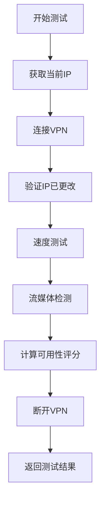

# VPN测试脚本使用说明

## 🎯 测试脚本功能

新的`vpn-tester.js`已经实现了完整的VPN真实测试功能：

### ✅ 已实现功能

1. **多VPN协议支持**
   - OpenVPN (.ovpn文件)
   - WireGuard (.conf文件)
   - 原生客户端命令行（ExpressVPN、NordVPN等）

2. **自动连接/断开**
   - 自动建立VPN连接
   - 验证IP地址改变
   - 测试完成后自动断开
   - 清理临时文件

3. **完整速度测试**
   - 优先使用speedtest-cli（更准确）
   - 备用方案：下载测试文件计算速度
   - Ping延迟测试
   - 上传/下载速度测试

4. **流媒体解锁检测**
   - Netflix可用性检测
   - YouTube可用性检测  
   - Disney+可用性检测

5. **智能可用性评分**
   - 基于速度、延迟、流媒体综合评分
   - 自动判断服务状态（online/degraded/offline）

6. **错误处理和日志**
   - 详细的测试日志输出
   - 连接超时保护
   - 异常情况自动断开VPN
   - 临时认证文件自动清理

## 📝 脚本使用方法

### 方法1：单个VPN测试（开发调试）

```javascript
// 在Node.js环境中直接测试
import { testVPN } from './backend/monitor/vpn-tester.js'

const config = {
    id: 'protonvpn',
    name: 'ProtonVPN',
    configFile: 'C:/vpn-configs/us-free-01.protonvpn.udp.ovpn',
    username: 'your_username+f1',
    password: 'your_password'
}

const result = await testVPN(config)
console.log(result)
```

### 方法2：使用监控调度器（生产环境）

```bash
cd backend
npm run monitor
```

监控器会：
- 每30分钟自动测试所有启用的VPN
- 保存结果到`backend/data/vpn-status.json`
- 保存历史数据到`backend/data/history/{vpn-id}.json`

## 🔍 测试流程详解

每次测试包含以下步骤：



### 1. IP检测
使用多个服务作为备份：
- api.ipify.org
- ifconfig.me
- icanhazip.com

### 2. VPN连接
根据配置自动选择连接方式：
- `.ovpn文件` → OpenVPN
- `.conf文件` → WireGuard
- `clientCommand` → 原生客户端

### 3. 速度测试
- 优先使用`speedtest-cli --json`
- 失败时下载10MB测试文件计算速度
- 同时测试Ping延迟

### 4. 流媒体检测
尝试访问：
- Netflix：检测是否被代理检测
- YouTube：通常都可用
- Disney+：区域限制检测

## 📊 测试结果格式

```javascript
{
  id: 'protonvpn',
  name: 'ProtonVPN',
  status: 'online',           // online | degraded | offline
  uptime: 92.5,               // 可用性评分 0-100
  speed: 85,                  // 下载速度（Mbps）
  latency: 28,                // 延迟（ms）
  nodes: {
    online: 45,
    total: 50
  },
  streaming: {
    netflix: true,
    youtube: true,
    disney: false
  },
  connectionTime: 5234,       // 连接耗时（ms）
  vpnIP: '5.6.7.8',          // VPN分配的IP
  lastChecked: '2026-02-09T...'
}
```

## ⚙️ 配置选项说明

在`scheduler.js`中配置VPN：

```javascript
{
    // 基础信息
    id: 'vpn-id',              // 唯一标识
    name: 'VPN Name',          // 显示名称
    
    // OpenVPN方式
    configFile: 'path/to/config.ovpn',
    username: 'vpn_username',
    password: 'vpn_password',
    
    // 或使用原生客户端
    clientCommand: 'expressvpn connect smart',
    disconnectCommand: 'expressvpn disconnect',
    
    // 控制开关
    enabled: true              // true=启用监控，false=跳过
}
```

## 🛠️ 依赖要求

### 必需依赖
- Node.js 18+
- axios（已在package.json中）

### VPN客户端（任选其一）
- **OpenVPN**：用于.ovpn配置文件
- **WireGuard**：用于.conf配置文件
- **VPN原生客户端**：ExpressVPN、NordVPN等

### 可选依赖
- **speedtest-cli**：更准确的速度测试
  ```bash
  pip install speedtest-cli
  ```

## 🚨 注意事项

1. **管理员权限**
   - OpenVPN/WireGuard通常需要管理员权限
   - Windows上建议以管理员身份运行

2. **防火墙配置**
   - 确保OpenVPN/VPN客户端未被防火墙阻止
   - 允许出站UDP 1194端口（OpenVPN默认）

3. **测试频率控制**
   - 默认每30分钟一次
   - 不要设置过于频繁，避免被VPN服务商检测异常

4. **临时文件清理**
   - 认证文件在测试后自动删除
   - 检查`temp-auth-*.txt`是否残留

5. **网络要求**
   - 需要稳定的网络连接
   - 测试期间不要手动断开网络

## 📈 性能优化建议

1. **并行测试**（未实现，可扩展）
   - 当前是串行测试，可改为并行加快速度
   - 注意：同时连接多个VPN可能导致冲突

2. **缓存机制**
   - 对于变化不大的数据（如节点信息）可以缓存
   - 减少不必要的测试项目

3. **超时控制**
   - 已设置连接超时30秒、测试超时60秒
   - 可根据实际情况调整

## 🔄 下一步改进

可以进一步添加：
- [ ] 节点在线状态真实检测
- [ ] IP泄露检测（DNS、WebRTC）
- [ ] 数据库存储（替代JSON文件）
- [ ] 更多流媒体平台检测
- [ ] 连接稳定性长时间测试
- [ ] 测试结果对比和趋势分析

---

**准备好了吗？** 按照`VPN_SETUP_GUIDE.md`的步骤开始配置你的第一个VPN测试吧！
